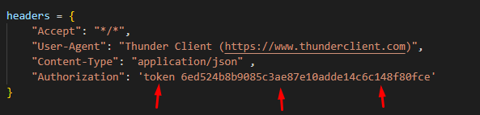

# PROJETO DEVNOLOGY

## Sobre.
-  **Este projeto é uma api onde replica os dados de produtos raspados de um site via Webscraping.**
**O usuário tem que estar logado e com acesso liberado via TOKEN (este token é criado pelo admin do sistema dentro do ADM do Django) para ter acesso a api, e na requisição terá que enviar o TOKEN no header, como mostrado na imagem abaixo**

 

- Foi desenvolvido a conexão com Cache Redis, que tem por sua vez a funcionalidade de armazenar a primeira requisição feita pelo usuário, para que nas proximas buscas dentro de 10 minutos, a api não precise fazer o Scrapy novamente, assim economizando memoria e tempo.

- A api retorna os mesmo dados em Json tanto nas raspagens de dados quanto nos dados retornados pelo Cache Redis

- Foi desenvolvido a conexão com AWS Dynamodb, para armazenar os dados a cada nova cada nova consulta após os 10 minutos, foi criado com a funcionalidade de alguma necessidade para obter os dados futuramente sem ser utilizando o Redis.

**Basta apenas descomentar os codigos em de conexão e importação com aws em products/viewsets.py**

E após isso, adicione os dados cde conexão  no arquivo .env
~~~shel
AWS_ACCESS_KEY_ID=ADICIONE-ACCESS_KEY_ID-AQUI
AWS_SECRET_ACCESS_KEY=ADICIONE-SECRET_ACCESS_KEY-AQUI
AWS_REGION=us-east-1
~~~
## AWS
 

## Passo a passo para Rodar a aplicação em seu computador/notebook

- Faça o clone do projeto
~~~clone
git clone https://github.com/By-Lucas/Project-Devnology-Api-WebScraping.git
~~~

- Crie um ambiente virtual e ative-o (`Windows`)
~~~virtual
python -m venv venv
~~~
~~~activate
venv/scripts/activate
~~~

- Crie um ambiente virtual e ative-o (`Linux`)<
~~~virtual
virtualenv -p python3 venv
~~~
~~~activate
source venv/bin/activate
~~~

- Faça as migrações as models
~~~activate
python manage.py migrate
~~~

## Postgres
**Se estiver tiver o Postgres instado na sua marquia, adicione os dados de conexão no arquivo `.env` e remova a conexão com `sqlite` em `devnolog/settings.py` e descomente a conexão logo acima feita com Postgres** 

~~~postgres
EMAIL_BACKEND=django.core.mail.backends.smtp.EmailBackend
EMAIL_HOST=smtp.gmail.com
EMAIL_PORT=587
EMAIL_HOST_USER=tekertudo@gmail.com
EMAIL_HOST_PASSWORD=lbrkulimopjljajs
~~~

## Cache Redis
**Faça o Download do arquivo Cache Redis [CLIQUE AQUI](https://redis.io/download/) e instale e se não tiver nenhum host disponivel para utiliza-lo remotamente, faça as alterações abaixo, caso contrário deixe-os como está e altere apenas para sua conexão HOST dentro do arquivo `.env`** 

~~~redis
REDIS_HOST=REDIS_HOST_AQUI
REDIS_PORT=REDIS_PORT_AQUI
REDIS_USERNAME=REDIS_USERNAME_AQUI
REDIS_PASSWORD=REDIS_USERNAME_AQUI
~~~

- Altere a conexão do Cache Redis para que está em `controllers/rediscache.py` para utilizar localmente

~~~redis
self.redis = Redis(
    host= config('REDIS_HOST'),
    port= config('REDIS_PORT'),
    username= config('REDIS_USERNAME'),
    password= config('REDIS_PASSWORD'),
    db=0)
~~~

**`Altere para:`**
~~~redis
self.redis = Redis(
    host= 'locahost',
    port= 6379,
    db=0)
~~~

## Pronto

- Crie um super usuário -Digite o código abaixo e siga o passo a passo
~~~shel
pyton manage.py createsuperuser
~~~

- Faça o Login no ADMIN e alterer o que desejar ou sete permissões para outros usuarios
~~~shel
http://127.0.0.1:8000/admin
~~~

- Rode a aplicação
~~~shel
pyton manage.py runserver
~~~

- Rota para todos os produtos raspados
~~~shel
http://127.0.0.1:8000/api/v1/products
~~~

- Fazer busca pela marca e modelo do produto:
~~~shel
http://127.0.0.1:8000/api/v1/product?product=lenovo
~~~